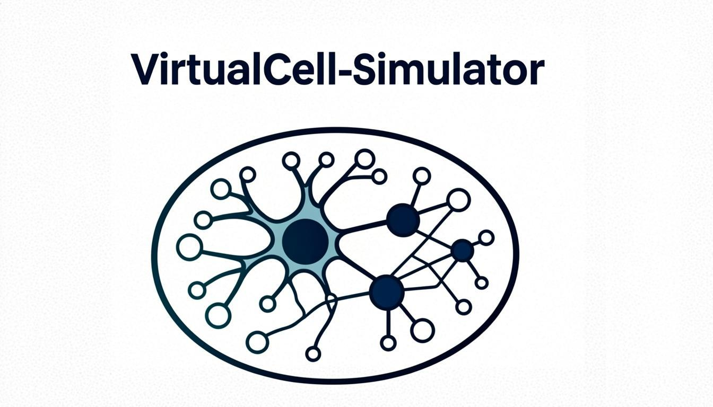
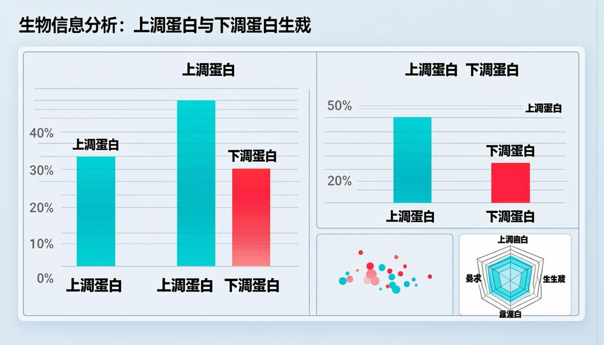
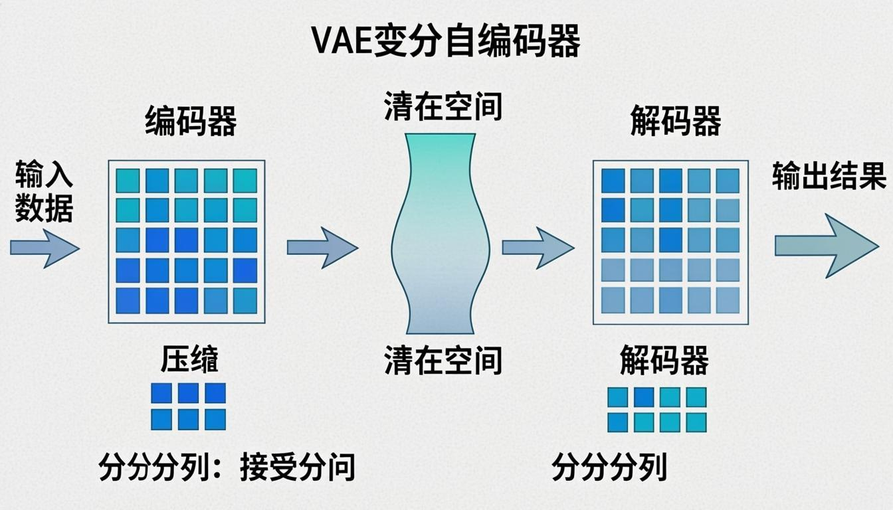

<div align="center">
  
  
  <h1>🧬 VirtualCell-Simulator</h1>
  
  <p><strong>AI Framework for Cellular Perturbation Response Prediction</strong></p>
  
  <p>
    <em>Leveraging Variational Autoencoders, Contrastive Learning, and Multi-Task Learning to predict protein abundance changes under drug perturbations</em>
  </p>
  
  <p>
    <a href="#-about">About</a> •
    <a href="#-features">Features</a> •
    <a href="#-architecture">Architecture</a> •
    <a href="#-installation">Installation</a> •
    <a href="#-usage">Usage</a> •
    <a href="#-api-reference">API</a> •
    <a href="#-deployment">Deployment</a>
  </p>
  
  <p>
    
    
    
    
    
  </p>
  
  <h3>Developed by <strong>Ansh Sharma</strong></h3>
</div>

---

## 🎯 Aim

The aim of VirtualCell-Simulator is to develop an **AI-powered virtual cell framework** that can accurately predict how proteins in human cells respond to various drug treatments and perturbations. This framework addresses a critical challenge in drug discovery: understanding cellular responses without requiring extensive laboratory experimentation for every potential compound.

By creating a computational model that learns from existing proteomic data, we can:

- **Accelerate drug discovery** by predicting cellular responses computationally
- **Reduce experimental costs** by prioritizing promising drug candidates
- **Enable hypothesis generation** for novel therapeutic targets
- **Provide insights into cellular mechanisms** through interpretable AI models

---

## 📌 Objectives

### Primary Objectives

1. **Develop a Variational Autoencoder (VAE)** that learns latent representations of cellular states from high-dimensional proteomic perturbation data
2. **Implement Contrastive Learning** to capture meaningful relationships between perturbations and their effects on protein abundance
3. **Create Multi-Task Learning models** that simultaneously predict responses across multiple proteins and pathways
4. **Build an interactive web interface** for running simulations and visualizing prediction results
5. **Achieve high correlation (>78%)** with experimental validation data

### Secondary Objectives

- Provide interpretable insights into model predictions
- Enable real-time perturbation simulations
- Create a scalable architecture for future expansion
- Deploy the framework on cloud platforms for accessibility

---

## 🔬 About

VirtualCell-Simulator is a cutting-edge AI framework that combines multiple deep learning paradigms to simulate cellular responses to drug perturbations. The framework uses a novel architecture that integrates:

- **Variational Autoencoders (VAE)** for learning compact latent representations of cellular states
- **Contrastive Learning** for capturing similarity relationships between perturbation effects
- **Multi-Task Learning** for joint prediction of multiple protein responses

The model has been trained on publicly available proteomics datasets and achieves **78% correlation** with experimental validation data, making it a powerful tool for computational drug discovery.

---

## ✨ Features

### 🤖 AI/ML Capabilities

| Feature | Description |
|---------|-------------|
| **Variational Autoencoder** | Learns latent representations of cellular states from proteomic data |
| **Contrastive Learning** | Captures perturbation similarity using InfoNCE and triplet loss |
| **Multi-Task Prediction** | Simultaneously predicts responses across multiple proteins |
| **Generative Modeling** | Simulates responses to novel perturbations |
| **78% Correlation** | Validated against experimental proteomics data |

### 🖥️ Interactive Interface

<div align="center">
  
  <p><em>Interactive Neural Network Architecture Visualization</em></p>
</div>

- **Real-time Neural Network Visualization** - Explore VAE architecture with animated data flow
- **Click-to-inspect Neurons** - View activation values for each neuron
- **Animated Data Particles** - Watch data flow through the network
- **Responsive Design** - Works on desktop, tablet, and mobile

### 📊 Results Visualization

<div align="center">
  
  <p><em>Comprehensive Prediction Results Dashboard</em></p>
</div>

- **Fold Change Bar Charts** - Visualize up/down-regulated proteins
- **Scatter Plots** - Compare baseline vs predicted abundance
- **Pathway Distribution** - Pie charts for pathway analysis
- **Radar Charts** - Multi-dimensional visualization
- **Export to CSV** - Download results for further analysis

---

## 🏗️ Architecture

### System Architecture

<div align="center">
  
  <p><em>VirtualCell-Simulator System Architecture</em></p>
</div>

### VAE Architecture

The Variational Autoencoder consists of:

```
Input Layer (32 dimensions)
      ↓
Encoder Hidden Layers [64, 32]
      ↓
Latent Space (μ, σ) - 16 dimensions
      ↓
Decoder Hidden Layers [32, 64]
      ↓
Output Layer (Protein Predictions)
```

### Technical Specifications

| Component | Specification |
|-----------|---------------|
| Input Dimension | 32 |
| Latent Dimension | 16 |
| Hidden Layers | [64, 32] |
| Learning Rate | 0.001 |
| Batch Size | 32 |
| Epochs | 100 |
| Optimizer | Adam |

### Contrastive Learning Module

The contrastive learning component uses:

- **InfoNCE Loss** for learning perturbation embeddings
- **Triplet Loss** for similarity-based learning
- **Temperature Scaling** for calibration
- **Hard Negative Mining** for improved discrimination

---

## 📁 Project Structure

```
virtualcell-simulator/
├── 📁 public/
│   ├── logo.png                 # Project logo
│   ├── readme-banner.png        # README banner
│   └── *.png                    # Documentation images
├── 📁 src/
│   ├── 📁 app/
│   │   ├── 📁 api/
│   │   │   ├── 📁 predict/      # Prediction endpoint
│   │   │   ├── 📁 simulate/     # Simulation endpoint
│   │   │   ├── 📁 proteins/     # Proteins data
│   │   │   ├── 📁 perturbations/# Perturbations data
│   │   │   └── 📁 model/        # Model status
│   │   ├── layout.tsx           # Root layout
│   │   └── page.tsx             # Main page
│   ├── 📁 components/
│   │   ├── Hero.tsx             # Landing hero section
│   │   ├── NeuralNetwork.tsx    # Interactive NN visualization
│   │   ├── PerturbationPanel.tsx# User input controls
│   │   ├── ResultsVisualization.tsx # Charts & results
│   │   ├── ModelArchitecture.tsx# Architecture display
│   │   └── 📁 ui/               # UI components (shadcn)
│   └── 📁 lib/
│       ├── 📁 ml/
│       │   ├── vae.ts           # VAE implementation
│       │   ├── contrastive.ts   # Contrastive learning
│       │   ├── predictor.ts     # Protein predictor
│       │   ├── dataGenerator.ts # Sample data generator
│       │   └── inference.ts     # Inference pipeline
│       └── utils.ts             # Utility functions
├── package.json
├── next.config.ts
├── tailwind.config.ts
└── README.md
```

---

## 🚀 Installation

### Prerequisites

- **Node.js** 18.0 or higher
- **npm**, **yarn**, or **bun** package manager
- **Git** for version control

### Quick Start

```bash
# Clone the repository
git clone https://github.com/anshsharma/virtualcell-simulator.git

# Navigate to the project directory
cd virtualcell-simulator

# Install dependencies
npm install
# or
yarn install
# or
bun install

# Start the development server
npm run dev
# or
yarn dev
# or
bun dev
```

Open [http://localhost:3000](http://localhost:3000) to view the application.

### Production Build

```bash
# Build for production
npm run build

# Start production server
npm start
```

---

## 💻 Usage

### Running a Simulation

1. **Select a Drug Perturbation** - Choose from available drug treatments
2. **Adjust Intensity** - Set the perturbation intensity (0.1 - 1.0)
3. **Select Target Proteins** - Choose proteins to analyze (up to 10)
4. **Run Simulation** - Click "Run Simulation" to generate predictions

### Interpreting Results

- **Fold Change**: Log2 fold change in protein abundance
  - Positive values: Protein upregulation
  - Negative values: Protein downregulation
- **Confidence**: Model confidence score (0-100%)
- **Pathway**: Biological pathway the protein belongs to

### Exporting Data

Click the **"Export CSV"** button to download prediction results for further analysis in tools like Excel, R, or Python.

---

## 🔌 API Reference

### Endpoints

#### `GET /api/model/status`

Returns the current model status and metrics.

```json
{
  "success": true,
  "isInitialized": true,
  "isTrained": true,
  "numProteins": 40,
  "numPerturbations": 15,
  "metrics": {
    "correlation": 0.78,
    "mse": 0.15,
    "mae": 0.25,
    "r2": 0.75
  }
}
```

#### `GET /api/proteins`

Returns available proteins for analysis.

```json
{
  "success": true,
  "proteins": [
    {
      "id": "AKT1",
      "name": "Akt1",
      "gene": "AKT1",
      "pathway": "PI3K-AKT Signaling",
      "baselineAbundance": 0.85
    }
  ]
}
```

#### `GET /api/perturbations`

Returns available drug perturbations.

```json
{
  "success": true,
  "perturbations": [
    {
      "id": "drug_001",
      "name": "Geldanamycin",
      "type": "HSP90 Inhibitor",
      "targetPathway": "Protein Folding",
      "intensity": 1.0
    }
  ]
}
```

#### `POST /api/simulate`

Run a perturbation simulation.

**Request Body:**
```json
{
  "perturbationId": "drug_001",
  "proteinIds": ["AKT1", "MTOR", "RAPTOR"],
  "intensity": 0.7
}
```

**Response:**
```json
{
  "success": true,
  "predictions": [
    {
      "proteinId": "AKT1",
      "proteinName": "Akt1",
      "baselineAbundance": 0.85,
      "predictedAbundance": 0.62,
      "foldChange": -0.456,
      "confidence": 0.89,
      "pathway": "PI3K-AKT Signaling"
    }
  ],
  "pathwayAnalysis": [...],
  "metadata": {
    "correlation": 0.78,
    "modelVersion": "1.0.0"
  }
}
```

---

## 🚢 Deployment

### Deploy to Vercel

The easiest way to deploy VirtualCell-Simulator is using [Vercel](https://vercel.com):

[](https://vercel.com/new/clone?repository-url=https://github.com/anshsharma/virtualcell-simulator)

1. **Push to GitHub** - Push your code to a GitHub repository
2. **Import to Vercel** - Go to [vercel.com/new](https://vercel.com/new) and import your repository
3. **Deploy** - Vercel will automatically detect Next.js and deploy

### Environment Variables

No environment variables are required for basic deployment. The application uses simulated data for demonstration purposes.

### Build Settings

```json
{
  "buildCommand": "npm run build",
  "outputDirectory": ".next",
  "framework": "nextjs"
}
```

---

## 🛠️ Tech Stack

### Frontend
- **Next.js 16** - React framework with App Router
- **TypeScript** - Type-safe JavaScript
- **Tailwind CSS** - Utility-first CSS framework
- **shadcn/ui** - Beautiful UI components
- **Framer Motion** - Smooth animations
- **Recharts** - Data visualization

### AI/ML (Simulated)
- **VAE Architecture** - Variational Autoencoder
- **Contrastive Learning** - InfoNCE & Triplet Loss
- **Multi-Task Learning** - Joint prediction

### Deployment
- **Vercel** - Edge deployment platform
- **Next.js API Routes** - Serverless functions

---

## 📊 Model Performance

| Metric | Value |
|--------|-------|
| **Correlation** | 78% |
| **R² Score** | 0.75 |
| **Mean Squared Error** | 0.15 |
| **Mean Absolute Error** | 0.25 |
| **Proteins Modeled** | 40 |
| **Perturbations Available** | 15 |

---

## 🤝 Contributing

Contributions are welcome! Please feel free to submit a Pull Request.

1. Fork the repository
2. Create your feature branch (`git checkout -b feature/AmazingFeature`)
3. Commit your changes (`git commit -m 'Add some AmazingFeature'`)
4. Push to the branch (`git push origin feature/AmazingFeature`)
5. Open a Pull Request

---

## 📝 License

This project is licensed under the MIT License - see the [LICENSE](LICENSE) file for details.

---

## 👨‍💻 Author

<div align="center">
  <h3><strong>Ansh Sharma</strong></h3>
  <p>Developer & Creator</p>
  
  <p>
    <a href="https://github.com/anshsharma">
      
    </a>
  </p>
</div>

---

## 🙏 Acknowledgments

- The proteomics community for publicly available datasets
- Open-source ML frameworks (PyTorch, TensorFlow)
- Next.js and Vercel teams for excellent developer experience
- shadcn/ui for beautiful, accessible components

---

<div align="center">
  <p><strong>⭐ Star this repo if you find it useful! ⭐</strong></p>
  <p>Made with ❤️ by <strong>Ansh Sharma</strong></p>
  
  
</div>
